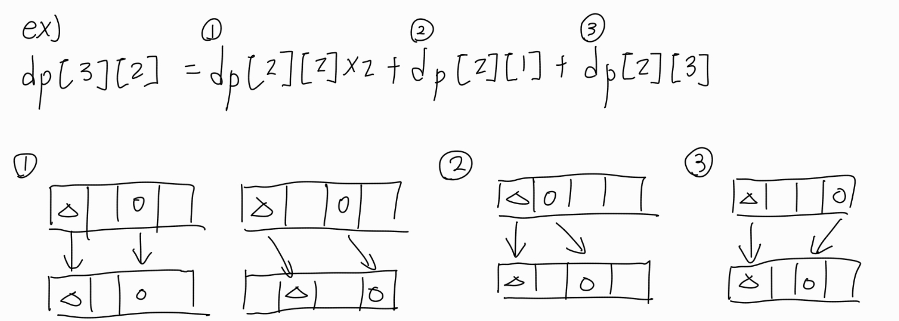

# 불장난

## 문제 설명
- 문제 링크: [링크](https://www.acmicpc.net/problem/14945)
- 핵심 사항: 
    - "1초에 아래 방향, 또는 오른쪽 아래 대각선으로만 한 칸을 움직일 수 있다."
    - "처음 불장난을 하던 타일을 제외하고 두 사람이 같은 타일 위에 선다면 두 사람은 부딪혀서 넘어지게 된다."
---

## 풀이 과정

### 1. **접근 방법**
- 삼각형의 i번째 줄에서 두 사람의 거리 차이 j를 가질 수 있는 경우의 수를 상태값으로 설정
- i번째 줄에 두 사람의 거리 차이가 j가 되려면 i-1번째 줄, j 거리 차이일때 각각 (아래,아래),(대각,대각)으로 이동, i-1번째 줄, j-1 거리 차이일때 각각(아래, 대각), i-1번째 줄, j+1 거리 차이일 때 각각(대각, 아래) 로 이동해야한다. 
    - dp[i][j] = dp[i-1][j]*2 + dp[i-1][j-1] + dp[i-1][j+1]
- ex)

### 2. **구현 단계**
1. 구현